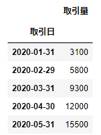

# 時系列データの扱い
数か月分の単純構造な時系列データを週単位や月単位で集計

<br>

## 時系列データの最初を表示
```
frame1.head()
```


<br>

## 時系列データの最後を表示
```
frame1.tail()
```


<br>

## 時系列データの特定期間を表示
```
frame1.loc['2020-01-08':'2020-01-12']
```


<br>

## 時系列データの週単位集計(平均値)の最初を表示
```
frame1.resample(rule='W').mean().head()
```


<br>

## 時系列データの週単位集計(合計値)の最初を表示
```
frame1.resample(rule='W').sum().head()
```


<br>

## 時系列データの月単位集計(平均値)の最初を表示
```
frame1.resample(rule='M').mean().head()
```


<br>

## 時系列データの月単位集計(合計値)の最初を表示
```
frame1.resample(rule='M').sum().head()
```


<br>

